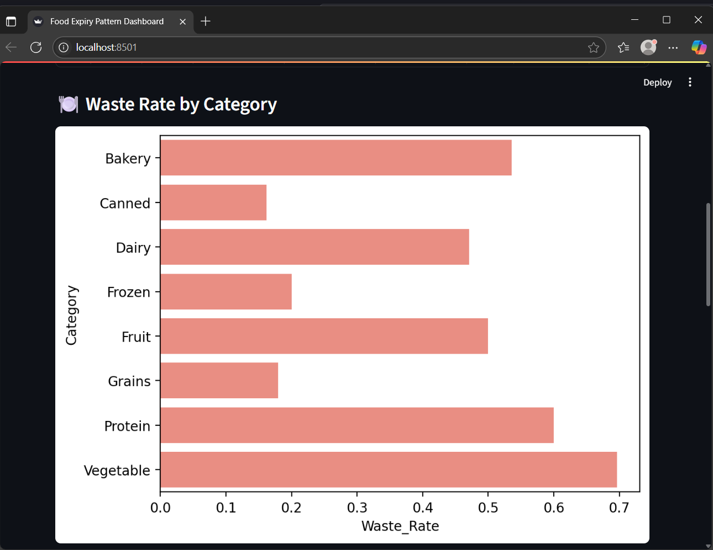
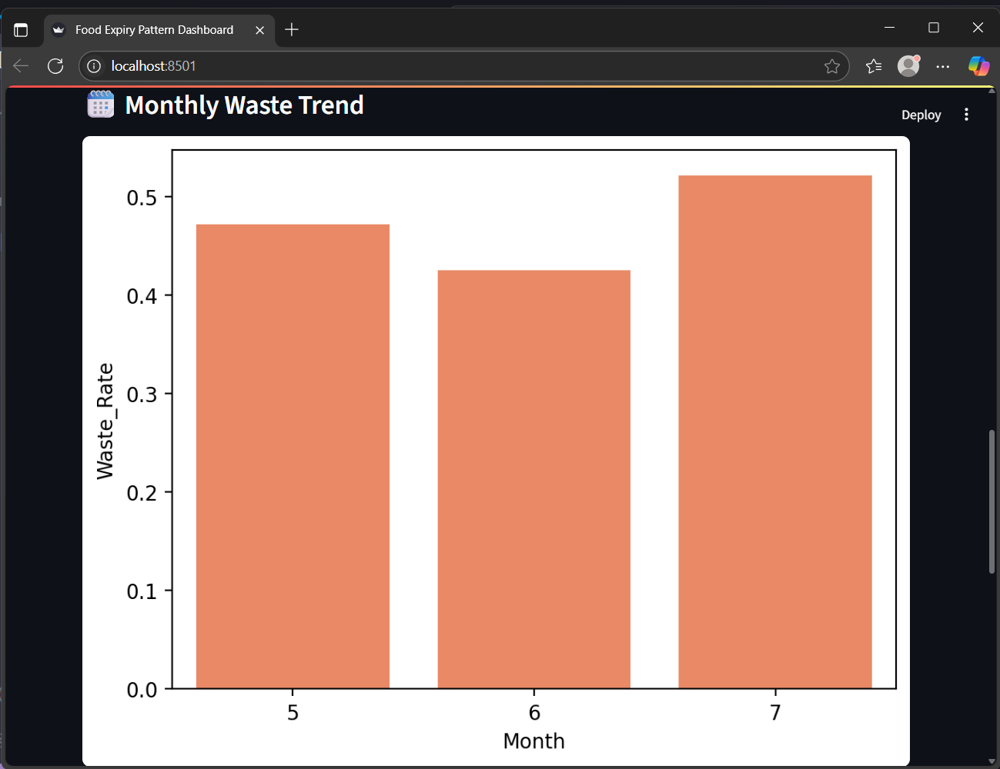
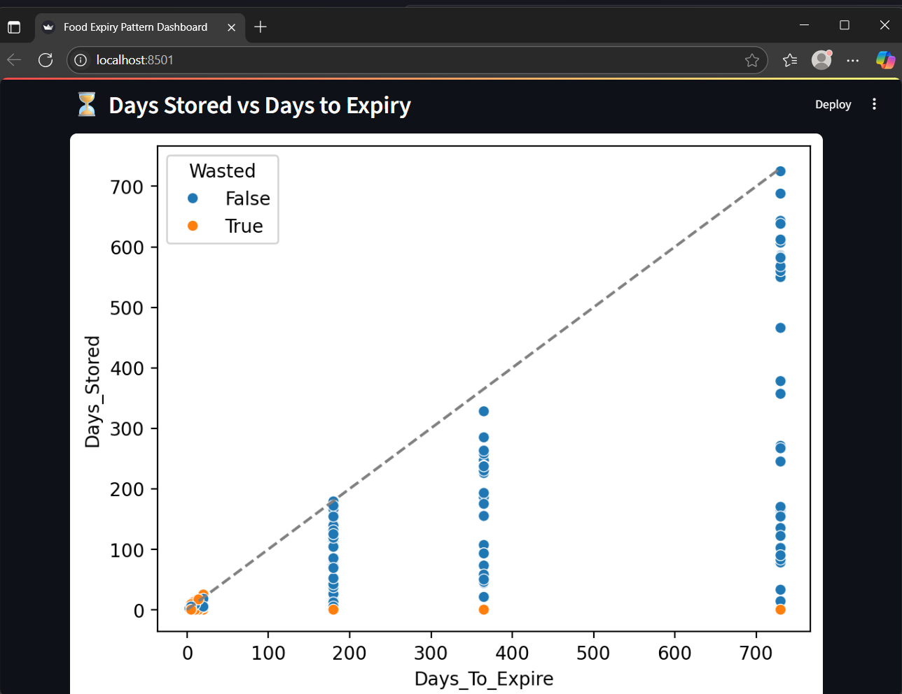

# 🥫 Food Expiry Pattern Analysis - Streamlit Web App

An interactive dashboard that helps analyze food consumption and waste patterns using either:
- 🧪 Synthetic food purchase data (CSV upload)
- ✍️ Manually typed-in bill data (form-based)

Built using **Streamlit**, **Pandas**, and **Seaborn**, this app visualizes waste trends by category and month, helping users improve their consumption habits.

---

## 🚀 Features

| Mode             | Input Method     | Dashboard Output                          |
|------------------|------------------|--------------------------------------------|
| 📤 **CSV Upload**    | Upload `.csv` file   | Full dashboard with expiry + waste insights |
| 📝 **Manual Entry**  | Fill form in app     | Dashboard based only on entered data        |

---

## 📊 Dashboard Insights

- Food waste rate by **category**
- Expiry and consumption trends by **month**
- Quantity statistics
- Visual insights using bar charts

